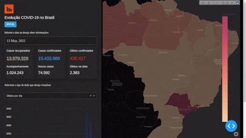

# Dashboard Interativo com os números da Covid-19 nos estados e municípios brasileiros
Projeto de um Dashboard desenvolvido com python que contém os dados da Covid 19 dos estados e do Brasil

#### Meus Comentários

Na construção deste Dashboard Interativo com os dados da COVID-19 no Brasil, desenvolvido em Python e utilizando Jupyter Notebook como ferramenta para análise e tratamento dos dados, tive a oportunidade de aprender um pouco sobre as biblitecas plotly, dash e dash-bootstrap-components, exercitei a softskill de como aprender a aprender e resolução de problema que me deparei durante o desenvolvimento deste projeto. Foi utilizado o Visual Studio Code, Git e Github.

#
#### Para executar o projeto, siga os passoa abaixo:

1. Clone o repositório

- `git clone https://github.com/jlfagundes/dashboard_covid19_brasil.git`.
- Entre na pasta do repositório que você acabou de clonar:
  - `dashboard_covid19_brasil`

2. Crie o ambiente virtual para o projeto

- `python3 -m venv .venv && source .venv/bin/activate`

3. Instale as dependências

- `python3 -m pip install -r requirements.txt`

4. Execture o arquivo main.py
- `python3 main.py`

#### Referências:
<ul>
  <li>
    <a href="https://asimov.academy/trilha-dashboards-com-python/?utm_source=youtube&utm_medium=video&utm_campaign=dash_covid_youtube">Tutorial da Asimov Academy</a>
  </li>
  <li>
    <a href="https://covid.saude.gov.br">Site do Governo Federal sobre a Covid-19</a>
  </li>
  <li>
    <a href="https://github.com/tbrugz/geodata-br">Geodata BR - Brasil</a>
  </li>
</ul>
